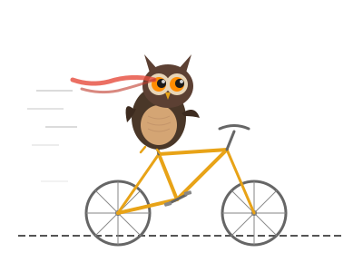

<p align="center">
  
</p>

<h1 align="center">Parliament of Owls</h1>

<p align="center">
  <em>Query multiple LLMs and deep research APIs in parallel.<br/>Post each response as a comment on a GitHub Issue.</em>
</p>

<p align="center">
  <a href="https://github.com/joelio/owl/actions"></a>
  <a href="https://github.com/joelio/owl/blob/main/LICENSE"></a>
  
</p>

---

Built on [Simon Willison's `llm`](https://github.com/simonw/llm) for standard model access, with direct API integrations for deep research endpoints. Supports dozens of free models via [OpenRouter](https://openrouter.ai).

## Install

```bash
# From source
pip install -e .

# Or globally with pipx (recommended)
pipx install .
```

## Quick Start

```bash
# 1. Configure your council (interactive picker)
owl council

# 2. Ask the council
owl ask "What are the tradeoffs between Redis and Memcached for session storage?"

# 3. Read from a file
owl ask -f research_question.md

# 4. Pipe from stdin
echo "Explain quantum computing" | owl ask

# 5. Post to a GitHub issue
owl ask "..." --gh owner/repo
owl ask "..." --gh owner/repo --issue 42
```

## Setting Up Models

### Standard Models (via `llm`)

Install `llm` plugins and set their API keys:

```bash
# OpenAI
llm install llm-openai          # included by default with llm
llm keys set openai              # paste your OpenAI API key

# Anthropic (Claude)
llm install llm-anthropic
llm keys set anthropic           # paste your Anthropic API key

# Google Gemini
llm install llm-gemini
llm keys set gemini              # paste your Google AI API key

# Mistral
llm install llm-mistral
llm keys set mistral             # paste your Mistral API key

# Grok (xAI)
llm install llm-grok
llm keys set grok                # paste your xAI API key

# DeepSeek
llm install llm-deepseek
llm keys set deepseek            # paste your DeepSeek API key

# Cohere
llm install llm-command-r
llm keys set cohere              # paste your Cohere API key

# OpenRouter (dozens of models, many free — no credit card needed)
llm install llm-openrouter
llm keys set openrouter          # paste your OpenRouter API key

# Local models via Ollama
llm install llm-ollama
# No key needed — just have Ollama running
```

Verify your installed models:

```bash
llm models                       # list all available models
```

Keys are stored in `~/Library/Application Support/io.datasette.llm/keys.json` (macOS) or `~/.config/io.datasette.llm/keys.json` (Linux).

You can also pass keys via environment variables (e.g. `OPENAI_API_KEY`) or inline with `--key`.

See the full [llm plugin directory](https://llm.datasette.io/en/stable/plugins/directory.html) for more providers.

### Free Models via OpenRouter

Sign up at [openrouter.ai](https://openrouter.ai) (no credit card required) and get a free API key. Many powerful models are completely free:

- **Claude 4.6 Opus** / Claude 4.5 Sonnet (Anthropic)
- **GPT-5 Nano** / GPT-4o Mini (OpenAI)
- **Gemini 3 Flash** / Gemma 3 27B (Google)
- **Grok 4.1 Fast** (xAI)
- **DeepSeek V3.2** (DeepSeek)
- **GLM-4.5 Air** (Z.ai)
- **Llama 3.3 70B** (Meta)
- **Mistral Small 3.1** (Mistral)
- Many more — run `llm models | grep ":free"` to see all

Rate limits: ~20 req/min, ~200 req/day per free model. Owl staggers requests to stay within limits.

### Deep Research APIs

Deep research models use direct API calls (not `llm` plugins). Set their keys as environment variables:

```bash
export OPENAI_API_KEY=sk-...        # o3-deep-research, o4-mini-deep-research
export PERPLEXITY_API_KEY=pplx-...  # sonar-deep-research
export GOOGLE_API_KEY=AI...         # Gemini Deep Research Agent
export DEEPSEEK_API_KEY=sk-...      # deepseek-reasoner
export XAI_API_KEY=xai-...          # Grok agentic search
```

Add these to your `~/.zshrc` or `~/.bashrc` to persist them.

### GitHub Integration

For posting results to GitHub Issues, owl uses your `gh` CLI auth or a `GITHUB_TOKEN`:

```bash
# Option A: gh CLI (recommended)
gh auth login

# Option B: environment variable
export GITHUB_TOKEN=ghp_...
```

## Commands

```bash
owl ask "prompt"                          # Query all council members
owl ask -f prompt.md                      # Read prompt from file
cat prompt.txt | owl ask                  # Read from stdin
owl ask "prompt" --gh owner/repo          # Create new issue with responses
owl ask "prompt" --gh owner/repo --issue 42  # Post to existing issue
owl council                               # Interactive TUI to select council members
owl council-list                          # Show current council
owl models                                # Show all available models
```

## Council Configuration

Run `owl council` to open the interactive selector:

```
🦉 Parliament of Owls — Select Your Council

 #   Model                      Source        Description
     Standard Models (via llm)
 1  ☑ gpt-5                     llm
 2  ☑ claude-sonnet-4.6         llm
 3  ☐ gemini-2.5-pro            llm
     Deep Research
 4  ☑ o3-deep-research          openai-deep   OpenAI Deep Research
 5  ☑ sonar-deep-research       perplexity    Perplexity Deep Research
 6  ☐ gemini-deep-research      google-deep   Gemini Deep Research Agent
 7  ☐ deepseek-reasoner         deepseek      DeepSeek Reasoner
 8  ☐ grok-agentic              xai           Grok 4.1 agentic search

Enter number to toggle, a=all, n=none, s=save, q=quit:
```

Saved to `~/.owl/config.yaml`.

## How Deep Research Works

Each provider implements deep research differently:

| Provider | What Happens | API |
|----------|-------------|-----|
| **OpenAI** | Separate model (`o3-deep-research`) that searches the web and synthesizes reports | Responses API |
| **Perplexity** | Separate model (`sonar-deep-research`) with multi-step retrieval and citations | `/chat/completions` |
| **Google Gemini** | Async agent that plans, searches, reads, and reasons (can take minutes) | Interactions API |
| **DeepSeek** | Reasoning model with chain-of-thought (`deepseek-reasoner`) | `/chat/completions` |
| **xAI Grok** | Grok 4.1 with agentic web + X search and thinking mode | Chat Completions + tools |

## Security

- API keys are stored via `llm`'s key management or environment variables — never in the owl config file
- The `~/.owl/config.yaml` only stores model names and sources, no secrets
- GitHub tokens are read from `gh` CLI auth or `GITHUB_TOKEN` env var
- All API calls use HTTPS
- Deep research providers use 5-minute timeouts with retry on transient failures

## Claude Code Plugin

Owl ships as a [Claude Code plugin](https://docs.anthropic.com/en/docs/claude-code/plugins), giving Claude full knowledge of the owl CLI, config, providers, and architecture.

### Install

```bash
claude plugin install https://github.com/joelio/owl
```

### What it provides

The `/owl:owl` skill teaches Claude how to:

- Use all owl CLI commands and flags
- Configure councils and debug model discovery
- Add new providers to the codebase
- Troubleshoot API key and connectivity issues
- Post results to GitHub Issues

### Local development

When working on owl itself, load the plugin from your local checkout:

```bash
claude --plugin-dir .
```

## Development

```bash
git clone https://github.com/joelio/owl.git
cd owl
pip install -e ".[dev]"
pytest tests/ -v
ruff check src/ tests/
ruff format src/ tests/
```

## Contributing

1. Fork the repo
2. Create a feature branch (`git checkout -b feature/amazing-owl`)
3. Make your changes with tests
4. Ensure `ruff check` and `pytest` pass
5. Open a PR

## License

MIT — see [LICENSE](LICENSE).
